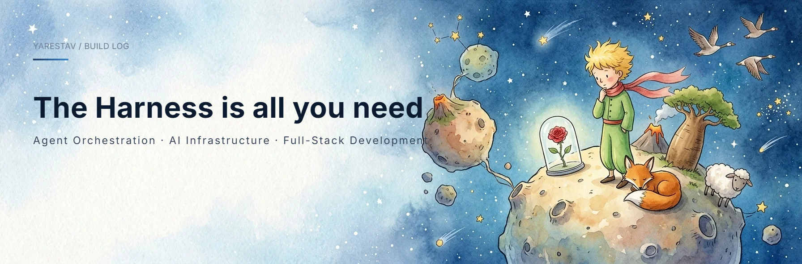

  
  
  

## Hello, I'm Yarestrv

I'm a full-stack developer working on **[web apps and developer tooling]**. My current focus is building **[what you're currently building]**, and I care about clean architecture, reliable systems, and things that just work.

I care about the details too: **[evaluation, durable state, observability]** — the unglamorous parts that make software dependable. Good software should survive edge cases and be easy to reason about.

## What I work on

<table>
  <tr>
    <td width="50%" valign="top">
      <h3>Frontend</h3>
      
I build fast, accessible interfaces with component-driven architecture and a strong design system.

      
<code>TypeScript</code> · <code>React</code> · <code>Vue</code> · <code>CSS</code>

    </td>
    <td width="50%" valign="top">
      <h3>Backend</h3>
      
I design APIs and services that are modular, observable, and easy to evolve.

      
<code>Node.js</code> · <code>Go</code> · <code>Python</code> · <code>PostgreSQL</code>

    </td>
  </tr>
  <tr>
    <td width="50%" valign="top">
      <h3>Tooling & quality</h3>
      
I automate the boring parts: tests, CI, deployments, and repeatable workflows.

      
<code>Docker</code> · <code>Git</code> · <code>CI/CD</code> · <code>Linux</code>

    </td>
    <td width="50%" valign="top">
      <h3>Product surfaces</h3>
      
I turn requirements into clean, inspectable product experiences people enjoy.

      
<code>TypeScript</code> · <code>FastAPI</code> · <code>Next.js</code>

    </td>
  </tr>
</table>

## Selected projects

<table>
  <tr>
    <td width="50%" valign="top">
      <h3><a href="https://github.com/yarestrv/[repo1]">Project One</a></h3>
      
A [one-line description of what this project does and the problem it solves].

      

        
        
      

    </td>
    <td width="50%" valign="top">
      <h3><a href="https://github.com/yarestrv/[repo2]">Project Two</a></h3>
      
A [one-line description of what this project does and the problem it solves].

      

        
        
      

    </td>
  </tr>
</table>

## GitHub Stats

  
  

  

## GitHub Roast

  Build patiently. Verify relentlessly. Keep what works.

