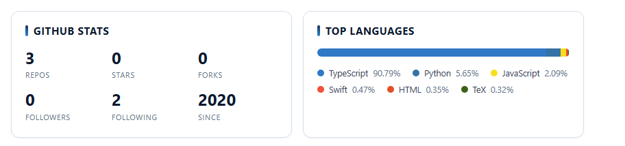

  
  
  

## Hello, I'm Yarestrv

I'm an engineer working on **AI Agent development** — building agent systems that plan, call tools, coordinate with each other, and stay dependable in production.

My current work also covers **Ontology** and **AIP Agent development**: grounding agents in a shared semantic layer, so they reason over real domain knowledge instead of guessing.

I care about the unglamorous parts too — evaluation, durable state, observability, and clear safety boundaries. A useful agent should be able to explain what it did, and recover when something goes wrong.

## What I work on

<table>
  <tr>
    <td width="50%" valign="top">
      <h3>AI Agent development</h3>
      
I build agent systems: task planning, tool use, memory, and multi-agent orchestration.

      
<code>Python</code> · <code>TypeScript</code> · <code>Tool protocols</code> · <code>Structured outputs</code>

    </td>
    <td width="50%" valign="top">
      <h3>Ontology</h3>
      
I model domain knowledge into a semantic layer that grounds agent reasoning in real data.

      
<code>Knowledge modeling</code> · <code>Knowledge graphs</code> · <code>RAG</code>

    </td>
  </tr>
  <tr>
    <td width="50%" valign="top">
      <h3>AIP Agent development</h3>
      
I develop agents on AIP — connecting models, tools, and data into repeatable workflows.

      
<code>AIP</code> · <code>Python</code> · <code>APIs</code>

    </td>
    <td width="50%" valign="top">
      <h3>Runtime &amp; reliability</h3>
      
Evaluation, durable state, and observability — so every agent run is inspectable and recoverable.

      
<code>Docker</code> · <code>CI/CD</code> · <code>Observability</code>

    </td>
  </tr>
</table>

## Selected projects

<table>
  <tr>
    <td width="50%" valign="top">
      <h3><a href="https://github.com/yarestrv/[repo1]">Project One</a></h3>
      
A [one-line description of what this project does and the problem it solves].

      

        
        
      

    </td>
    <td width="50%" valign="top">
      <h3><a href="https://github.com/yarestrv/[repo2]">Project Two</a></h3>
      
A [one-line description of what this project does and the problem it solves].

      

        
        
      

    </td>
  </tr>
</table>

## GitHub Stats

  

  

## GitHub Roast

  Build patiently. Verify relentlessly. Keep what works.

